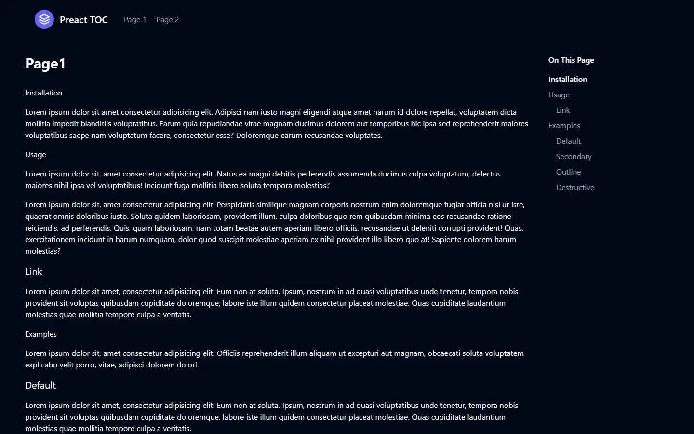

# 📑 Preact TOC

 [](https://www.npmjs.com/package/@forthtilliath/preact-toc) [](https://preactjs.com/) 

> Un hook headless pour Preact qui génère automatiquement un sommaire ("On this page") à partir des titres de ta page, avec mise en surbrillance de la section active au scroll (scrollspy) — comme sur la documentation de Stripe, Tailwind ou shadcn/ui.

**🔗 Démo :** [preact-page-navigation.vercel.app](https://preact-page-navigation.vercel.app/page-1)



## Pourquoi

Générer un sommaire qui reste synchronisé avec le scroll de la page est un besoin récurrent (documentation, articles longs, changelogs...), mais implique de la logique répétitive : parcourir les titres, construire une arborescence, observer les sections visibles. Ce package encapsule tout ça dans un seul hook, sans imposer de style — à toi de brancher ta propre UI (`Sidebar`, `Nav`, etc.) par-dessus.

## Installation

```bash
npm install @forthtilliath/preact-toc
# ou
pnpm add @forthtilliath/preact-toc
```

`preact` (>=10) est requis en peer dependency.

## Usage

```tsx
import { useNavigation, H2, H3 } from "@forthtilliath/preact-toc";

function Article() {
  const [articleRef, items, activeId] = useNavigation();

  return (
    <>
      <article ref={articleRef}>
        <H2>Installation</H2>
        <p>...</p>

        <H3>Prérequis</H3>
        <p>...</p>

        <H2>Usage</H2>
        <p>...</p>
      </article>

      {/* À toi de construire ta propre sidebar avec `items` et `activeId` */}
      <MySidebar items={items} active={activeId} />
    </>
  );
}
```

### API

| Export                      | Description                                                                                     |
| ---------------------------- | ------------------------------------------------------------------------------------------------ |
| `useNavigation(dataAnchor?)` | Hook principal. Retourne `[ref, items, activeId]` : `ref` à poser sur le conteneur de l'article, `items` l'arborescence du sommaire, `activeId` l'id de la section actuellement visible. |
| `useActiveItem(elements)`    | Hook bas niveau : observe une liste d'éléments (`IntersectionObserver`) et retourne l'id de celui actuellement visible. |
| `buildNavigationStructure(headings)` | Construit l'arborescence `Item[]` à partir d'une liste de titres HTML (H2 → H6). |
| `H2` / `H3` / `H4`           | Composants de titre prêts à l'emploi : génèrent un `id` à partir du texte et l'attribut `data-anchor` nécessaire au hook. |

## Ce que contient ce repo

- **`lib/`** — le code source du package publié sur npm (headless, sans dépendance de style).
- **`src/`** — une application de démo Preact + Tailwind CSS montrant une intégration complète avec une sidebar stylée, déployée sur Vercel.

## Développement

```bash
# installer les dépendances
bun install

# lancer la démo en local
bun run dev

# builder le package (dist-lib/)
bun run build:lib
```

## Licence

Distribué sous licence [MIT](./LICENSE).
